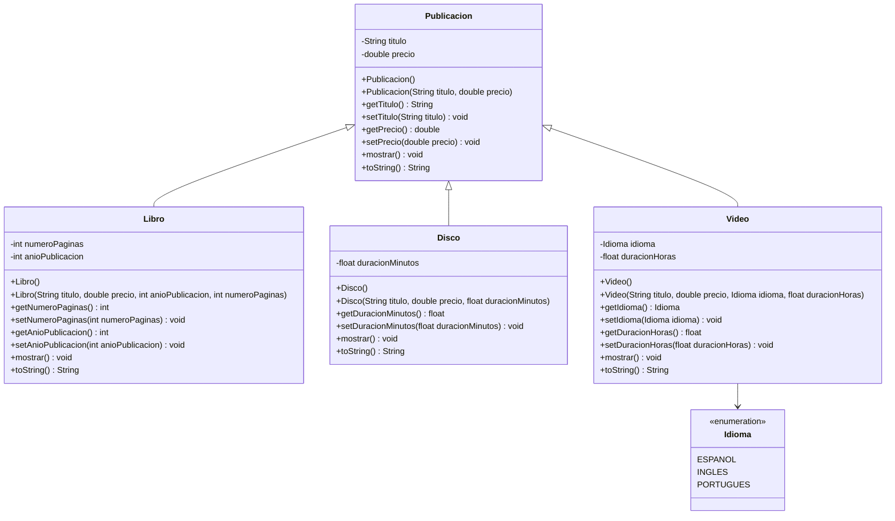

# Diagrama de clases

```mermaid
classDiagram
    class Publicacion {
        -String titulo
        -double precio
        +Publicacion()
        +Publicacion(String titulo, double precio)
        +getTitulo() String
        +setTitulo(String titulo) void
        +getPrecio() double
        +setPrecio(double precio) void
        +mostrar() void
        +toString() String
    }

    class Libro {
        -int numeroPaginas
        -int anioPublicacion
        +Libro()
        +Libro(String titulo, double precio, int anioPublicacion, int numeroPaginas)
        +getNumeroPaginas() int
        +setNumeroPaginas(int numeroPaginas) void
        +getAnioPublicacion() int
        +setAnioPublicacion(int anioPublicacion) void
        +mostrar() void
        +toString() String
    }

    class Disco {
        -float duracionMinutos
        +Disco()
        +Disco(String titulo, double precio, float duracionMinutos)
        +getDuracionMinutos() float
        +setDuracionMinutos(float duracionMinutos) void
        +mostrar() void
        +toString() String
    }

    class Video {
        -Idioma idioma
        -float duracionHoras
        +Video()
        +Video(String titulo, double precio, Idioma idioma, float duracionHoras)
        +getIdioma() Idioma
        +setIdioma(Idioma idioma) void
        +getDuracionHoras() float
        +setDuracionHoras(float duracionHoras) void
        +mostrar() void
        +toString() String
    }

    class Idioma {
        <<enumeration>>
        ESPANOL
        INGLES
        PORTUGUES
    }

    Publicacion <|-- Libro
    Publicacion <|-- Disco
    Publicacion <|-- Video
    Video --> Idioma
```